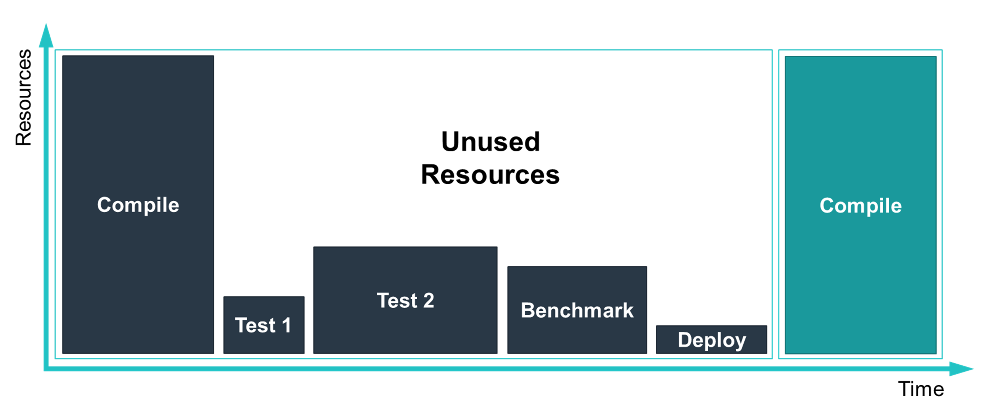
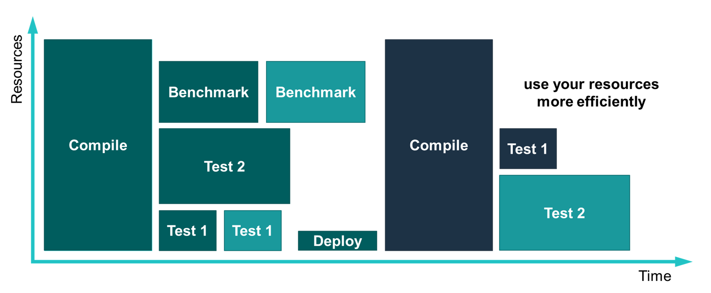

# A Cloud Native CI System
InfraBox is an [open source](https://github.com/InfraBox/infrabox) continuous integration system based on Kubernetes. It can be used to run all your CI jobs like compilation of your software, tests and benchmarks, but it is not limited to it.
Many people ask why do we need another CI system, because there are already plenty out there. We at SAP Data Hub found that these CI tools did not solve many of our CI problems.
Now depending on the CI tool you use you may have the same or similar issues:

- __Stable Environment__: Some of our build infrastructure is based on Jenkins and it's shared with several other projects. This leads to situations where new libraries on the Jenkins slave had to be installed which where incompatible with some other projects. So updates of the workers broke builds for some other projects. This is of course a real issue on production build systems where we rely on fast and stable execution of builds and test.

- __Isolation__: To make better use of the hardware jobs are usually run in parallel on the same machine. It's in the responsibility of the developers to make sure that parallel running jobs don't conflict somehow. They better don't write to the same location on the filesystem or access other shared resources. For some tools this was even not possible to prevent. Also some jobs may leave trash behind or change the configuration of the machine. This is something you don't want to happen in your CI system. You want to have reproducible  builds if possible, which is only possible if you can isolate the different jobs.

- __Resource Limits__: To increase the hardware utilization it's important to run many jobs in parallel on the same machines (with the issues described before). But you also want to make sure that each job gets the resources in terms of CPU and memory which it needs. If you can't assign resource limits to your jobs it may happen that one job consumes all the memory of your machine and all the concurrent jobs fail, because they run out of memory. This also leads to a higher restart rate and a lower hardware utilization and to increased costs for your CI system.

- __Flexibility__: Many of the CI Systems are quite static. You define a set of jobs and run them. Often the jobs are always the same and they are not flexible. If you want to have more flexibility you add logic inside one of the jobs to i.e. run more or less tests depending on some criteria, but this usually means all the tests run in the same job. So it's not easily possible to dynamically decide how many resources each job and a specific test set should get. As an example we have some quite big git repositories and we would like to run only tests for components which have been changed and not for all of them and the different tests should have different resource limits. You might also have multiple branches and would like to run different jobs on each of them. This can be quite difficult to achieve in a clean way on some CI systems.

- __Reproducibility__: The setup of the CI machines are often different to the developer's machine. So we often hear that a certain issue can't be reproduced by a developer on their machine and they therefore need ssh access to a build machine to investigate the issue. This does obviously not scale with many developers and should be handled differently.

- __Native Kubernetes Support__: As we build a Cloud Native application on top of Kubernetes we want our CI tool to natively integrate with it. So it makes our lives easier when we run all our tests. This is not yet the case with other CI systems.

To better deal with these issues we came up with a new CI system called InfraBox, which runs everything in Docker containers on a Kubernetes cluster. Before we ran different tasks sequentially to ensure stable results, but this left quite some resources unused.



Now we can run multiple jobs in parallel with different resource limits and a much better isolation.



Let's have a look at a simple "hello world" example to demonstrate its benefits. You need two files for you first InfraBox job. All starts with a Dockerfile in which you can define what should be executed. InfraBox will build and run the container. A very simple Dockerfile looks like this:

```
FROM alpine
CMD echo "Hello World"
```

Using Docker simplifies many things. We can now define the environment (OS, packages, environment variables, etc.) for each job separately. So one job may use __debian__ another job may use __alpine__ for its tests. So you don't have to configure the worker machine anymore in a way that it can satisfy the requirements of all jobs running on it. As every job is a separate container we also gain a much better isolation. Now instead of having a shared filesystem and libraries between all the jobs we only have a shared kernel and this is rarely an issue. InfraBox does also not force you to use any custom syntax. You can write your jobs in the language you want to use, the only requirement is that it has to run in a Docker container.

The second file you need is _infrabox.json_ in the root directory of your project to define the jobs you want to run:

```json
{
    "version": 1,
    "jobs": [{
        "type": "docker",
        "name": "hello-world",
        "docker_file": "Dockerfile",
        "resources": { "limits": { "cpu": 1, "memory": 1024 } },
        "build_only": false
    }]
}
```

As you can see we define one job with type __docker__ (InfraBox supports also other job types, see [the InfraBox examples](https://github.com/InfraBox/examples/tree/master)), a name, the path to the Dockerfile (docker_file), assign resource limits and tell it to not only build but also run the Docker container (build_only). That's it. You can now run the job on your local machine with the [infraboxcli](https://github.com/infrabox/cli)

```
infrabox run
```

Or connect your GitHub/Gerrit repository with an InfraBox instance and trigger a build every time you push to your repository (of course pull requests and statuses updates are supported).
InfraBox will then checkout your code and start all the jobs defined in your _infrabox.json_ file by building the containers and running them with the assigned resource limits in the Kubernetes Cluster.

We already mentioned that missing flexibility is an issue in some CI systems. InfraBox tries to solve that with a few features. First you can define multiple jobs for one build. Each with a separate Dockerfile and resource limits:

```json
{
    "version": 1,
    "jobs": [{
        "type": "docker",
        "name": "job-1",
        "resources": { "limits": { "cpu": 1, "memory": 1024 } },
        "build_only": false,
        "docker_file": "Dockerfile_1"
    }, {
        "type": "docker",
        "name": "job-2",
        "resources": { "limits": { "cpu": 2, "memory": 2048 } },
        "build_only": false,
        "docker_file": "Dockerfile_2",
    }]
}
```

So you may use this to test your software on different operating systems, with different resource limits or to simply run different jobs in parallel. InfraBox will automatically run all jobs in parallel if the defined dependencies allow it. See our [example](https://github.com/SAP/InfraBox-examples/tree/master/dependencies) on how you can define dependencies between jobs and even transfer data from one job to another. This is useful if you i.e. want to compile your software in the first job and have one or multiple successor jobs which take the compiled binary and run some tests in different environments.

To be even more flexible InfraBox offers some more features. You may _include_ some build definition [from another git repository](https://github.com/SAP/InfraBox-examples/tree/master/git_workflows) into your own build. So you can reuse parts of your build workflow across projects. Or you [modify your build workflow at runtime](https://github.com/SAP/InfraBox-examples/tree/master/dynamic_workflows). So you don't have to have a static workflow definition at the beginning of your build. We use it to dynamically detect which components have been changed in a commit and decide at runtime which jobs to start, as we only want to test the components which have been affected by the change. This may significantly reduce your build and test times if you have big repositories with many components. 

We mentioned earlier that reproducibility is sometimes a big issue. With InfraBox it's possible to not only to run jobs as containers on a Kubernetes cluster, but also download the containers (including its inputs & caches) to your local machine and execute exactly the same container again. So you don't have to ssh into a build machine anymore, instead you can reproduce your issues at your machine with all your tools you have installed.

Last but not least InfraBox offers a flexible extension Mechanism called Services. You may add your own services to provide additional resources to your jobs at runtime. Currently InfraBox ships two services. One for creating a [kubernetes namespace](https://github.com/SAP/InfraBox/tree/master/src/services/namespace) and one for creating a separate [kubernetes cluster on GKE](https://github.com/SAP/InfraBox/tree/master/src/services/gcp). We use it to run our end-to-end tests in the isolated namespace or even cluster. So you may use it to deploy your application into a temporary namespace and run your tests. When your job finishes, InfraBox will clean up after your job, so you don't have to deal with leftovers. Kubernetes supports quotas for namespaces which can also make sure that a certain job doesn't use too many resources in its namespace. And for the isolation of namespaces features like Network Policies are used to further isolate the Kubernetes namespaces and make sure your jobs are isolated from others as good as possible, even if you use a temporary namespace.

To provision a temporary namespace simply add another resource to your job definition:

```json
{
    "version": 1,
    "jobs": [{
        "type": "docker",
        "name": "temp-namespace",
        "resources": {
            "limits": { "cpu": 1, "memory": 1024 },
        },
        "build_only": false,
        "docker_file": "Dockerfile",
        "services": [{
            "apiVersion": "namespace.service.infrabox.net/v1alpha1",
            "kind": "ClusterNamespace",
            "metadata": {
              "name": "my-namespace"
            }
        }]
    }]
}
```

The credentials for the service account are mounted into your job. For a full example how to access the namespace with _kubectl_ see our [example](https://github.com/SAP/InfraBox-examples/tree/master/service_namespace).

Another useful consequence of using Kubernetes is that you can easily spin it up on all big clouds and use features like auto-scaling and preemptible virtual machines. This may reduce your costs for your CI system significantly, because VMs are only started on demand and shut down if no jobs are running. And with preemptible virtual machines you may save even more, because they are a lot cheaper, but can be stopped at any time by your cloud provider. In case of a shutdown or failure of a VM, Kubernetes will restart your job and InfraBox can handle this.

This was a quick run through of some of the issues we faced with our CI solutions and how we can overcome them with the help of InfraBox. The current version is stable and it's already used in production for testing SAP Data Hub. The feature set of InfraBox will be extended in the coming months. 

If you want to try out InfraBox just head over to the [github](https://github.com/InfraBox/infrabox) repository and follow the installation instructions. Also don't miss the introduction video in which some more features are explained. As this is an open  source project please provide feedback or even better start contributing. Any help is welcome!

More examples can be found in the [InfraBox example repository](https://github.com/InfraBox/examples).
